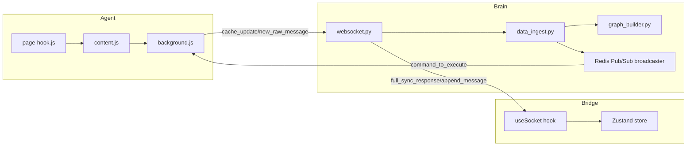

# PROJECT GUIDE — OnlyFans Conversational Analytics  
  
This document defines the **source-of-truth overview** for how this project is structured, coded, and extended.    
It is **aligned with [`communication-spec.md`](communication-spec.md)** and intended for both humans and AI code generators and to ensure consistent architecture, style, and purpose across the codebase.  
  
---  
  
## PROJECT NAME  
**OnlyFans Conversational Analytics** — A FastAPI + Pydantic application that ingests, enriches, stores, and analyzes creator–fan conversations using a therapy-research-style **Labeled Property Graph (LPG)** in Azure Cosmos DB (Gremlin API).  
  
---  
  
## PROJECT GOALS  
1. Fetch creator–fan conversations from the OnlyFans API or local extension database.    
2. Enrich messages with NLP (topic extraction, sentiment, embeddings).    
3. Store enriched data in a **Labeled Property Graph** modeled after psychotherapy research schemas.    
4. Provide analytical endpoints for dashboards (volume, trends, sentiment, engagement metrics).    
5. Integrate a modern **Vite + React** frontend served directly from FastAPI.    
6. Maintain a clean, modular architecture that’s easy to extend.    
7. Integrate a browser extension to enable compliant OF ↔ FastAPI bridge.    
  
---  
  
## FOLDER STRUCTURE & PURPOSES  
  
### [`app/`](app/)  
* **Purpose:** Main backend application code.  
* **Files:**  
  * [`main.py`](app/main.py): FastAPI entry point. Registers all routes and WS endpoints, connects/disconnects global broadcaster.  
  * [`core/config.py`](app/core/config.py): Centralized configuration — includes `REDIS_URL` (Pydantic `RedisSettings`) for Pub/Sub.  
* **Subfolders:**  
  * [`models/`](app/models/): Pydantic data schemas.  
  * [`models/wss.py`](app/models/wss.py): WS payload models with `type: Literal[...]` discriminators; contains `IncomingWssMessage` and `OutgoingWssMessage` unions.  
  * [`services/`](app/services/): Business logic and data processing.  
  * [`api/endpoints/`](app/api/endpoints/): All REST + WS endpoints.  
  * [`utils/`](app/utils/): Helper utilities (logging, time parsing, normalization).  
  * [`static/`](app/static/): Vite build artifacts.  
  * [`templates/`](app/templates/): Jinja templates used for serving frontend entrypoints.  
  
### [`app/models/`](app/models/)  
* **Purpose:** Define all data models for type safety and validation.  
* **Files:**  
  * [`core.py`](app/models/core.py): Raw message/conversation models before enrichment.  
  * [`graph.py`](app/models/graph.py): LPG node and edge models.  
  * [`insights.py`](app/models/insights.py): Response models for analytics endpoints.  
  * [`wss.py`](app/models/wss.py): WS type-safe message contracts.  
* **Style:**  
  * Use `BaseModel` from Pydantic v2+.  
  * Include type hints and optional fields.  
  * Keep models pure (no methods except validators).  
  
### [`app/services/`](app/services/)  
* **Purpose:** Implement business logic and data workflows.  
* **Files:**  
  * [`onlyfans_client.py`](app/services/onlyfans_client.py): Handles authenticated calls to the OnlyFans API or extension DB.  
  * [`enrichment.py`](app/services/enrichment.py): NLP enrichment (sentiment, topics, embeddings). Publishes AI commands via broadcaster.  
  * [`graph_builder.py`](app/services/graph_builder.py): Implements `rebuild_graph_from_snapshot()` and `append_graph_from_delta()` for Cosmos DB.  
  * [`insights_service.py`](app/services/insights_service.py): Executes Gremlin queries to compute analytics metrics.  
  * [`data_ingest.py`](app/services/data_ingest.py): **Dual-mode ingestion** with per-user `asyncio.Queue`:  
    - `handle_snapshot(user_id, payload)`  
    - `handle_delta(user_id, payload)`  
    - `_process_delta_queue(user_id)`  
* **Style:**  
  * Keep functions small and focused.  
  * No direct HTTP response handling — return Python objects/models only.  
  
### [`app/api/endpoints/`](app/api/endpoints/)  
* **Purpose:** Define HTTP/WS endpoints and map them to services.  
* **Files:**  
  * [`websocket.py`](app/api/endpoints/websocket.py): Stateless WS endpoint using Redis broadcaster + Pydantic unions.  
  * [`schema.py`](app/api/endpoints/schema.py): GET `/api/v1/schemas/wss` — returns `OutgoingWssMessage` JSON schema for frontend type generation.  
  * [`insights.py`](app/api/endpoints/insights.py): REST analytics endpoints.  
  * [`frontend.py`](app/api/endpoints/frontend.py): Serves compiled React frontend.  
* **Style:**  
  * Validate inputs with Pydantic models.  
  * Return typed responses.  
  * WS errors via `system_error` payload.  
  
### [`app/utils/`](app/utils/)  
* **Purpose:** Reusable helper functions.  
* **Files:**  
  * [`logger.py`](app/utils/logger.py): Configures logging.  
  * [`time.py`](app/utils/time.py): Time conversion and formatting helpers.  
  * [`normalization.py`](app/utils/normalization.py): Cleans and normalizes raw message payloads.  
* **Style:**  
  * Keep utilities stateless and pure.  
  
---  
  
## GRAPH SCHEMA (LPG)  
**Vertices:**  
* `Fan(fanId, joinDate, demographics, sentimentProfile)`  
* `Creator(creatorId, niche, styleProfile)`  
* `ConversationNode(conversationId, startDate, endDate, messageCount, averageResponseTime, turns, silencePercentage)`  
* `Topic(topicId, description, embedding, category)`  
* `EngagementAction(actionId, name, embedding, type)`  
* `InteractionOutcome(outcomeId, name, score, date)`  
  
**Edges:**  
* `HAS_CONVERSATION(fan -> conversation)`  
* `DISCUSS_TOPIC(conversation -> topic)`  
* `USES_ENGAGEMENT(conversation -> engagementAction)`  
* `TARGETS_TOPIC(engagementAction -> topic)`  
* `RESULTS_IN_OUTCOME(conversation -> interactionOutcome)`  
* `FOLLOWED_BY(conversation -> conversation)` — chronological linkage.  
  
---  
  
## CODING STYLE  
* **Language:** Python 3.10+  
* **Framework:** FastAPI  
* **Models:** Pydantic BaseModel + Discriminated Unions  
* **Type Safety:** Always use explicit type hints (`List[str]`, `Optional[float]`, etc.)  
* **Error Handling:** REST → `HTTPException`; WS → `system_error` payloads  
* **Imports:** Absolute imports only  
* **Docstrings:** Short, purpose-driven  
* **Function Size:** Small, single-purpose  
* **Separation of Concerns:**  
  * Endpoints → network I/O  
  * Services → business logic  
  * Models → data validation  
  
---  
  
## NLP ENRICHMENT PIPELINE  
* **Input:** Raw conversation messages (from API or extension DB).  
* **Steps:**  
  1. Sentiment analysis (transformer or spaCy).  
  2. Topic extraction (NER or keyword clustering).  
  3. Semantic embeddings (`sentence-transformers`).  
  4. Engagement action classification.  
* **Output:** Enriched conversation data ready for LPG insertion.  
  
---  
  
## GREMLIN QUERY PATTERNS  
* **Precision Engagement Analysis:** Find engagement actions that correlate with positive sentiment for similar topics.  
* **Mechanism of Engagement Change:** Trace sequences of engagement actions over time.  
* **Community Detection:** Louvain clustering on Topics to reveal social substructures.  
* **Centrality Analysis:** Identify “keystone topics” with high interconnectivity.  
  
---  
  
## BEST PRACTICES  
* Keep each folder’s `README.md` up to date.  
* Use `.env` for secrets (API keys, DB connection).  
* Log all service-level errors.  
* Write unit tests for services before deployment.  
* No manual edits to generated type files.  
  
---  
  
## AI PROMPT USAGE  
When asking AI to generate or refactor code:  
1. **Paste this document first** into the session.  
2. Describe the feature or file you want.  
3. The AI must:  
   * Place new code in the correct folder.  
   * Follow Pydantic + FastAPI + LPG conventions.  
   * Integrate cleanly with enrichment or insights flows.  
   * Maintain WS type safety via [`wss.py`](app/models/wss.py).  
   * Respect MV3 keepalive handling.  
  
---  
  
## FRONTEND INTEGRATION (VITE + FASTAPI)  
**Purpose:** Provide a unified full-stack architecture where the **FastAPI backend** (NLP, enrichment, graph, analytics) serves both API endpoints and the **React frontend** built with **Vite** — without breaking the domain-driven backend structure.  
  
**Type Synchronization:**  
* REST: Generated from `/openapi.json` via `@hey-api/openapi-ts`.  
* WS: Generated from `/api/v1/schemas/wss` via `json-schema-to-typescript`.  
  
**State Management:** Zustand store implementing snapshot-then-delta logic.  
  
---  
  
## BROWSER EXTENSION INTEGRATION (MV3 Agent)  
**Purpose:** Capture OnlyFans events, store in IndexedDB, forward to Brain via WS.  
  
**Files:**  
* [`manifest.json`](extension/manifest.json): MV3; `"minimum_chrome_version": "116"`, `"externally_connectable"`, necessary permissions.  
* [`background.js`](extension/background.js): Service Worker:  
  - Connect WS to Brain; keepalive every ~20s.  
  - Snapshot: send `cache_update` from IndexedDB.  
  - Delta: send `new_raw_message` on each event.  
  - Commands: forward `command_to_execute` to active tab via `chrome.tabs.sendMessage`.  
* [`content.js`](extension/content.js): Isolated world bridge.  
* [`page-hook.js`](extension/page-hook.js): Monkey-patches fetch/WS/XHR to capture events.  
  
**IndexedDB Schema:**  
* DB: `OnlyFansAnalyticsDB`  
* Stores: `messages`, `chats`  
  
**Security:**  
* Passive capture only.  
* Restrict external connections.  
  
---  
  
## SYSTEM DIAGRAM  

---
  
✅ **This file** (`AI-instructions.md`) is the authoritative reference for all future AI or human contributions to this repository.    
  
Any generated or refactored code must **strictly conform** to the structure, style, and conventions defined here and in [`communication-spec.md`](communication-spec.md).  
