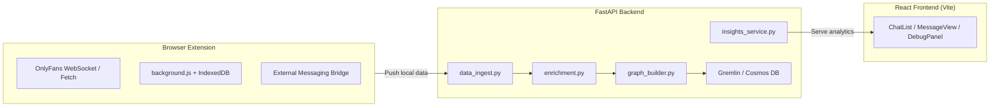

# PROJECT GUIDE — OnlyFans Conversational Analytics  
  
This document defines the **source-of-truth overview** for how this project is structured, coded, and extended.    
It is **intended for both humans and AI code generators** to ensure consistent architecture, style, and purpose across the codebase.  
  
---  
  
## PROJECT NAME  
  
**OnlyFans Conversational Analytics** — A FastAPI + Pydantic application that ingests, enriches, stores, and analyzes creator–fan conversations using a therapy-research-style **Labeled Property Graph (LPG)** in Azure Cosmos DB (Gremlin API).  
  
---  
  
## PROJECT GOALS  
  
1. Fetch creator–fan conversations from the OnlyFans API or local extension database.  
2. Enrich messages with NLP (topic extraction, sentiment, embeddings).  
3. Store enriched data in a **Labeled Property Graph** modeled after psychotherapy research schemas.  
4. Provide analytical endpoints for dashboards (volume, trends, sentiment, engagement metrics).  
5. Integrate a modern **Vite + React** frontend served directly from FastAPI.  
6. Maintain a clean, modular architecture that’s easy to extend.  
7. Integrate a browser extension to enable compliant OF ↔ FastAPI bridge.  

---  
  
## FOLDER STRUCTURE & PURPOSES  
  
### `app/`  
* **Purpose:** Main backend application code.  
* **Files:**  
  * `main.py`: FastAPI entry point. Registers all routes and configures the app.  
  * `config.py`: Centralized configuration (env vars, DB connection settings).  
* **Subfolders:**  
  * `models/`: Pydantic data schemas.  
  * `services/`: Business logic and data processing.  
  * `routes/`: FastAPI endpoint definitions.  
  * `utils/`: Helper utilities (logging, time parsing, normalization).  
  * `static/`: Vite build artifacts served to the browser.  
  * `templates/`: Jinja templates used for serving frontend entrypoints.  
  
### `app/models/`  
* **Purpose:** Define all data models for type safety and validation.  
* **Files:**  
  * `core.py`: Raw message/conversation models before enrichment.  
  * `graph.py`: LPG node and edge models (Fan, Creator, ConversationNode, Topic, EngagementAction, InteractionOutcome, GraphEdge).  
  * `insights.py`: Response models for analytics endpoints.  
* **Style:**  
  * Use `BaseModel` from Pydantic.  
  * Include type hints and optional fields.  
  * Keep models pure (no methods except validators).  
  
### `app/services/`  
* **Purpose:** Implement business logic and data workflows.  
* **Files:**  
  * `onlyfans_client.py`: Handles authenticated calls to the OnlyFans API or browser extension database.  
  * `enrichment.py`: NLP enrichment (sentiment, topics, embeddings).  
  * `graph_builder.py`: Converts enriched conversations into LPG vertices and edges for Cosmos DB.  
  * `insights_service.py`: Executes Gremlin queries to compute analytics metrics.  
  * `data_ingest.py`: Bridges local IndexedDB → FastAPI → Cosmos ingestion pipeline.  
* **Style:**  
  * Keep functions small and focused.  
  * No direct HTTP response handling — only return Python objects or models.  
  
### `app/routes/`  
* **Purpose:** Define HTTP endpoints and map them to services.  
* **Files:**  
  * `conversations.py`: Endpoints for fetching and processing conversations.  
  * `insights.py`: Endpoints for returning analytical metrics.  
  * `frontend.py`: Serves the compiled React frontend (via Jinja + manifest.json).  
* **Style:**  
  * Validate inputs with Pydantic models.  
  * Return typed responses.  
  * Use `HTTPException` for error handling.  
  
### `app/utils/`  
* **Purpose:** Reusable helper functions.  
* **Files:**  
  * `logger.py`: Configures application-wide logging.  
  * `time.py`: Time conversion and formatting helpers.  
  * `normalization.py`: Cleans and normalizes raw message payloads.  
* **Style:**  
  * Keep utilities stateless and pure.  
  
---  
  
## GRAPH SCHEMA (LPG)  
  
**Vertices:**    
* `Fan(fanId, joinDate, demographics, sentimentProfile)`  
* `Creator(creatorId, niche, styleProfile)`  
* `ConversationNode(conversationId, startDate, endDate, messageCount, averageResponseTime, turns, silencePercentage)`  
* `Topic(topicId, description, embedding, category)`  
* `EngagementAction(actionId, name, embedding, type)`  
* `InteractionOutcome(outcomeId, name, score, date)`  
  
**Edges:**    
* `HAS_CONVERSATION(fan -> conversation)`  
* `DISCUSS_TOPIC(conversation -> topic)`  
* `USES_ENGAGEMENT(conversation -> engagementAction)`  
* `TARGETS_TOPIC(engagementAction -> topic)`  
* `RESULTS_IN_OUTCOME(conversation -> interactionOutcome)`  
* `FOLLOWED_BY(conversation -> conversation)` — chronological linkage.  
  
---  
  
## CODING STYLE  
  
* **Language:** Python 3.10+  
* **Framework:** FastAPI  
* **Models:** Pydantic BaseModel  
* **Type Safety:** Always use explicit type hints (`List[str]`, `Optional[float]`, etc.).  
* **Error Handling:** Use `HTTPException` in routes. Log errors in services.  
* **Imports:** Use absolute imports (`from app.models.core import Message`) not relative.  
* **Docstrings:** Provide short docstring for each function explaining its purpose.  
* **Function Size:** Keep functions small and single-purpose.  
* **Separation of Concerns:**  
  * Routes → HTTP request/response  
  * Services → Business logic  
  * Models → Data structure and validation  
  
---  
  
## NLP ENRICHMENT PIPELINE  
  
* **Input:** Raw conversation messages (from API or extension DB).  
* **Steps:**  
  1. Sentiment analysis (transformer or spaCy).  
  2. Topic extraction (NER or keyword clustering).  
  3. Semantic embeddings (`sentence-transformers`).  
  4. Engagement action classification.  
* **Output:** Enriched conversation data ready for LPG insertion.  
  
---  
  
## GREMLIN QUERY PATTERNS  
  
* **Precision Engagement Analysis:** Find engagement actions that correlate with positive sentiment for similar topics.  
* **Mechanism of Engagement Change:** Trace sequences of engagement actions over time.  
* **Community Detection:** Louvain clustering on Topics to reveal social substructures.  
* **Centrality Analysis:** Identify “keystone topics” with high interconnectivity.  
  
---  
  
## BEST PRACTICES  
  
* Keep each folder’s `README.md` up to date.  
* Use `.env` for secrets (API keys, DB connection).  
* Log all service-level errors.  
* Write unit tests for services before deployment.  
* Ensure AI-generated code adheres to this architecture exactly.  
  
---  
  
## AI PROMPT USAGE  
  
When asking AI to generate or refactor code:  
1. **Paste this document first** into the session.  
2. Then describe the feature or file you want.  
3. The AI must:  
   * Place new code in the correct folder.  
   * Follow Pydantic + FastAPI + LPG conventions.  
   * Integrate cleanly with enrichment or insights flows.  
   * Include proper docstrings and typed signatures.  
  
---  
  
## FRONTEND INTEGRATION (VITE + FASTAPI)  
  
**Purpose:** Provide a unified full-stack architecture where the **FastAPI backend** (NLP, enrichment, graph, analytics) serves both API endpoints and the **React frontend** built with **Vite** — without breaking the domain-driven backend structure.  
  
---  
  
### 📁 Directory Layout  
  
```plaintext  
onlyfans-conversational-analytics/  
├── app/  
│   ├── main.py  
│   ├── config.py  
│   ├── models/  
│   │   ├── core.py  
│   │   ├── graph.py  
│   │   └── insights.py  
│   ├── services/  
│   │   ├── onlyfans_client.py  
│   │   ├── enrichment.py  
│   │   ├── graph_builder.py  
│   │   ├── insights_service.py  
│   │   └── data_ingest.py  
│   ├── routes/  
│   │   ├── conversations.py  
│   │   ├── insights.py  
│   │   └── frontend.py  
│   ├── utils/  
│   │   ├── logger.py  
│   │   ├── time.py  
│   │   └── normalization.py  
│   ├── static/  
│   │   └── dist/  
│   └── templates/  
│       └── index.html  
├── frontend/  
│   ├── index.html  
│   ├── vite.config.js  
│   ├── package.json  
│   └── src/  
│       ├── main.jsx  
│       ├── App.jsx  
│       └── components/  
│           ├── ChatList.jsx  
│           ├── MessageView.jsx  
│           └── DebugPanel.jsx  
├── extension/  
│   ├── manifest.json  
│   ├── background.js  
│   ├── content.js  
│   ├── page-hook.js  
│   └── icons/  
│       ├── icon16.png  
│       ├── icon48.png  
│       └── icon128.png  
├── requirements.txt  
└── README.md  
```  

### 🧠 Integration Principles (Aligned with This Guide)

| Layer                      | Purpose                                        | Integration                                       |
| --------------------------- | ---------------------------------------------- | ------------------------------------------------- |
| **FastAPI (`app/`)**        | Backend API, NLP, enrichment, graph, analytics | Keeps existing domain-driven structure.           |
| **Frontend (`frontend/`)**  | React UI served via Vite                       | Built to `/app/static/dist` with `manifest.json`. |
| **Runtime Config**          | Inject dynamic values (WS URL, extension ID)   | Via Jinja in `index.html`.                        |
| **Deployment**              | Unified FastAPI app serving API + frontend     | `uvicorn app.main:app` serves both layers.        |

---

### 🔌 Browser Extension Integration

**Purpose:**  
Captures OnlyFans chat and engagement events directly from the browser, stores them in IndexedDB, and exposes them to the backend.

---

#### 📁 Files

- `manifest.json` — Extension metadata, permissions, externally connectable backend origins.  
- `background.js` — Parses WS/API calls, normalizes records, writes to IndexedDB, responds to backend queries.  
- `content.js` — Injects `page-hook.js` early, bridges page ↔ background messaging.  
- `page-hook.js` — Hooks WebSocket, Fetch, and XHR to capture relevant traffic.  
- `icons/` — Icons used in extension UI.  

---

#### 🗄️ IndexedDB Schema

- **DB Name:** `OnlyFansAnalyticsDB`  
- **Stores:**  
  - `messages` (key: `id`)  
  - `chats` (key: `id`)  

---

#### 🔙 Backend Commands

- `get_all_chats_from_db`  
- `get_all_messages_from_db`  

---

#### 🔐 Security

- Passive capture only — no site modification.  
- Local storage only — no cloud sync.  
- External connection restricted to `http://localhost:8000/*`.  

---

### System Diagram — Conceptual Flow  



✅ **This file (`AI-instructions.md`) is the authoritative reference** for all future AI or human contributions to this repository.  
Any generated or refactored code must **strictly conform** to the structure, style, and conventions defined here.  
