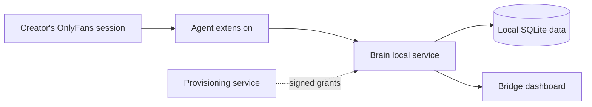

# OnlyFans Conversational Analytics

OnlyFans Conversational Analytics is a Windows application for creators that processes conversation data on the creator's computer. It captures conversation activity visible to the signed-in creator and presents conversation, engagement, response-time, topic, and sentiment analytics.

> [!IMPORTANT]
> This project is independent. It is not affiliated with, endorsed by, or sponsored by OnlyFans or its operator. The OnlyFans trademark is used only to describe compatibility and purpose.

## What it does

- **Agent** is a Chromium MV3 extension that captures conversation data available to the signed-in creator.
- **Brain** is the local backend. It validates and stores captured data, derives analytics, and serves the local API.
- **Bridge** is the web interface. It reads Brain-owned data and analytics.
- Conversation content stays on the creator's computer.

## How it works

Agent sends captured data to Brain on the same computer. Brain stores the conversation data and derived analytics. Bridge reads that local state through Brain.

A hosted provisioning service can issue signed grants used to configure the installation. It does not receive conversation content.

## Install on Windows

Releases contain a per-user Windows installer, a separate Agent extension bundle, and SHA-256 digests. Installation does not require administrator rights, Python, Node.js, or a repository checkout.

See [Install on Windows](docs/install-windows.md) for requirements, first run, Agent installation, data location, and uninstall instructions.

## Local data

The default data directory is `%LOCALAPPDATA%\OnlyFans Conversational Analytics`. It contains the authoritative local databases and runtime configuration.

Uninstalling the application removes program files but leaves this data directory in place.

## Repository

- `app/` — Brain backend and local runtime.
- `frontend/` — Bridge web interface.
- `extension/` — Agent browser extension.
- `contracts/` — shared contract snapshots.
- `docs/` — installation, acceptance, and architecture documentation.
- `packaging/` — Windows packaging and release assembly.
- `tools/` — development, acceptance, and end-to-end tooling.

## Documentation

- [Windows installation](docs/install-windows.md)
- [Contributing](CONTRIBUTING.md)
- [Documentation index](docs/README.md)

## License

See [LICENSE](LICENSE).
