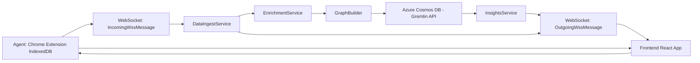

# App  
  
This folder contains the main application code for the **OnlyFans Conversational Analytics** platform.  
  
The backend is a **FastAPI** service that ingests conversation data from a Chrome extension, enriches it with NLP, builds a **Labeled Property Graph (LPG)**, computes analytics, and streams updates to frontend clients over **WebSockets** via a Redis Pub/Sub backend.  
  
---  
  
## Structure  
  
- **main.py** — FastAPI entry point:  
  - Initializes the API  
  - Configures CORS for frontend + extension  
  - Mounts static files from the Vite build  
  - Registers API and WS routers  
  - Manages global `Broadcast` lifecycle (Redis Pub/Sub)  
  
- **core/config.py** — Environment variables and configuration via `pydantic-settings`:  
  - Redis connection URL  
  - Extension ID  
  - Cosmos DB connection settings  
  - Other service configs  
  
- **models/** — Pydantic models for **type‑safe** data validation:  
  - `core.py` — Base OnlyFans message & conversation models, system payloads  
  - `ingest.py` — Snapshot (`cache_update`) and delta (`new_raw_message`) payloads  
  - `graph.py` — LPG vertices, edges, enrichment payloads  
  - `insights.py` — Analytics response models  
  - `commands.py` — AI‑generated command payloads  
  - `auth.py` — Authentication models  
  - `wss.py` — Typed WebSocket message envelopes (Incoming / Outgoing discriminated unions)  
  
- **services/** — Business logic and data processing:  
  - `data_ingest.py` — Race‑condition‑safe ingestion pipeline with delta queues  
  - `enrichment.py` — NLP enrichment (topics, actions, sentiment, outcomes)  
  - `graph_builder.py` — Build/rebuild/append LPG vertices & edges  
  - `insights_service.py` — Compute and broadcast analytics metrics  
  - `onlyfans_client.py` — Retrieve cached chats/messages from ingestion cache  
  
- **api/endpoints/** — FastAPI route definitions:  
  - `websocket.py` — Unified WS hub for extension & frontend clients  
  - `insights.py` — REST analytics endpoints  
  - `schema.py` — `/api/v1/schemas/wss` for auto‑generation of WS TS types  
  - `frontend.py` — Serves frontend app via Jinja template  
  
- **utils/** — Helper functions and utilities:  
  - Logging  
  - Normalization  
  - Time parsing  
  
---  
  
## Notes  
  
The application is built to support:  
  
- **Creator analytics dashboards** for OnlyFans  
- **Therapy‑research‑style graph models** stored in Azure Cosmos DB via the Gremlin API  
- Real‑time WS updates for:  
  - Initial full sync (`full_sync_response`)  
  - New messages (`append_message`)  
  - Analytics metrics (`analytics_update`)  
  - NLP enrichment results (`enrichment_result`)  
  - AI‑generated commands (`command_to_execute`)  
  
---  
  
## Refactor Highlights  
  
- **Stateless Pub/Sub backend** — Global `Broadcast` object using Redis  
- **Type‑safe WS protocol** — Pydantic discriminated unions in `wss.py`  
- **Auto‑generated WS TypeScript types** — `/api/v1/schemas/wss` endpoint  
- **Race‑condition‑safe ingestion** — Per‑user `asyncio.Queue` for deltas until snapshot processed  
- **Unified WS hub** — All extension/frontend WS traffic handled in `websocket.py`  
- **Removed legacy ingestion REST routes** — All ingestion now via WS  
  
---  
  
## Data Flow Overview  
  

