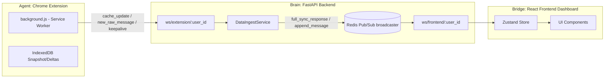
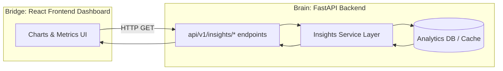

# API Endpoints  
  
Contains **FastAPI route definitions** for the API layer of OnlyFans Conversational Analytics.  
  
## Components  
  
### **frontend.py**  
Serves the compiled **Vite + React** frontend via Jinja2 templates, injecting runtime configuration:  
  
- `EXTENSION_ID` from `.env`  
- `FASTAPI_WS_URL` for WebSocket bridge (computed from `request.base_url`)  
- Entry JS/CSS paths from Vite `manifest.json`  
  
**Path(s):**  
- `GET /` — Returns `index.html` with injected config & asset links.  
  
### **insights.py**  
REST analytics endpoints returning aggregated conversational metrics:  
  
- `/api/v1/insights/topics` — Volume, % total, and trend for each topic.  
- `/api/v1/insights/sentiment-trend` — Average sentiment score trend over time.  
- `/api/v1/insights/response-time` — Average handling time (AHT), silence percentage, and turns.  
  
### **websocket.py**  
Unified WebSocket hub for **real‑time ingestion and broadcasting** using Redis Pub/Sub and type‑safe Pydantic unions:  
  
- `/ws/extension/{user_id}` — **Agent (Chrome extension)** → Brain ingestion pipeline.  
  - Receives:  
    - `cache_update` (full snapshot from IndexedDB)  
    - `new_raw_message` (delta event)  
    - `keepalive` (MV3 service worker persistence ping)  
  - Publishes processed data via Redis Pub/Sub.  
- `/ws/frontend/{user_id}` — **Bridge (React dashboard)** live updates.  
- `/ws/chatwoot/{user_id}` — External integration channel.  
  
### **schema.py**  
Schema exposure for **auto‑generated frontend WebSocket types**:  
  
- `/api/v1/schemas/wss` — Returns JSON Schema for `OutgoingWssMessage`.  
  - Used by frontend build scripts to generate TypeScript WS types automatically (`json-schema-to-typescript`).  
  
## Purpose  
  
Endpoints:  
- Accept HTTP or WebSocket requests.  
- Validate all parameters and payloads with Pydantic models (`IncomingWssMessage`, `OutgoingWssMessage`).  
- Call appropriate service functions:  
  - `DataIngestService.handle_snapshot()` / `.handle_delta()` for ingestion.  
  - Analytics services for insight metrics.  
  - Enrichment and graph building for conversation data.  
- Return typed responses, ensuring consistent schema across REST and WS.  
- WS errors are sent via `system_error` payload.  
  
## Schema Consistency  
  
- All real‑time conversation data is sent via WS using `OutgoingWssMessage` types as per spec.  
- Snapshot (`cache_update`) and delta (`new_raw_message`) flows share the same core models for chats/messages.  
- Frontend TypeScript types for WS are auto‑generated from `/api/v1/schemas/wss` — ensuring exact parity between backend and frontend payloads.  
- Analytics routes return isolated insight models (`FullSyncResponse`, `AnalyticsUpdate`), unaffected by ingestion pipeline changes.  
  
## WebSocket Ingestion Pipeline  
  

  
## REST Analytics Pipeline  
  

## Removed Legacy Endpoints  
  
As part of the [refactor](https://github.com/ramiradwan/onlyfans-conversational-analytics/issues/1)  
- **`conversations.py`** (legacy REST ingestion/cache routes) was removed.  
- All ingestion now happens over WebSocket, ensuring race‑condition safe processing and stateless backend operation.  
  
---  