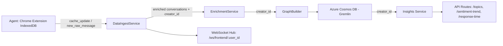

# Services  
  
Contains the **business logic** and **data processing pipelines** for OnlyFans Conversational Analytics.  
  
---  
  
## Components  
  
### **data_ingest.py**  
Race‑condition‑safe ingestion service for chat/message data from the **Agent** (Chrome extension).  
  
**Responsibilities:**  
- Buffer incoming `new_raw_message` deltas in a per‑user `asyncio.Queue` until the initial `cache_update` snapshot is processed.  
- Maintain a per‑user in‑memory cache of the latest chats and messages (for direct queries via `OnlyFansClient`).  
- Convert raw dict payloads into validated Pydantic models (`CacheUpdatePayload`, `NewRawMessagePayload`).  
- Enrich conversations, rebuild or append to the Labeled Property Graph (LPG), and broadcast updates via **Redis Pub/Sub**.  
- Broadcast analytics updates after each ingestion step.  
- Pass **`creator_id`** through enrichment, graph, and analytics calls for multi‑creator traceability and filtering.  
- Publish WS messages to the `frontend_user_{user_id}` channel:  
  - `system_status`  
  - `full_sync_response`  
  - `append_message`  
  - `analytics_update`  
  
**Key Methods:**  
- `handle_snapshot(user_id, payload, creator_id)` — Process full snapshot (`cache_update`), enrich all conversations, rebuild graph, broadcast `full_sync_response`, drain delta queue.  
- `handle_delta(user_id, payload, creator_id)` — Handle single delta (`new_raw_message`); queue if snapshot not ready, else apply immediately.  
- `_process_delta_queue(user_id, creator_id)` — Apply all queued deltas after snapshot completion.  
- `_apply_delta(user_id, delta, creator_id)` — Enrich just the affected conversation, append to graph, broadcast `append_message` and `analytics_update`.  
- `_broadcast_status(user_id, status)` — Send `system_status` message.  
- `get_cached_chats(user_id)` / `get_cached_messages(user_id)` — Return validated models from cache.  
  
---  
  
### **onlyfans_client.py**  
Facade for retrieving OnlyFans chat data from the **DataIngestService** cache.  
  
**Preferred source:** Browser extension ingestion flow via `DataIngestService`.  
  
**Key Methods:**  
- `get_chats(user_id, limit, offset)` — Chats from cache; sliced.  
- `get_messages(user_id, chat_id, limit, offset)` — Messages for a specific chat.  
- `get_chat_with_messages(user_id, chat_id, message_limit)` — Single chat thread with messages attached.  
  
---  
  
### **enrichment.py**  
NLP enrichment pipeline for conversations.  
  
**Processes:**  
Validated conversation models → Extracts semantic + behavioral features → Produces structured enrichment objects for graph building and analytics.  
  
**Features Extracted:**  
- Topics (NER, keyword clustering, embeddings)  
- Engagement actions (message type classification)  
- Sentiment analysis  
- Interaction outcomes (tips, renewals, drop‑offs)  
  
**Key Methods:**  
- `enrich_conversation(conversation, all_messages=None)` — Returns an `ExtendedConversationNode` with topics, actions, sentiment, and outcomes.  
- `broadcast_enrichment(user_id, conversations, all_messages=None, creator_id=None)` — Enriches and publishes `enrichment_result` WS messages to `frontend_user_{user_id}`. Includes `creator_id` in logs for multi‑creator traceability.  
  
---  
  
### **graph_builder.py**  
Converts enriched conversation data into LPG vertices and edges for **Azure Cosmos DB (Gremlin API)**.  
  
**Supports:**  
- **Full graph rebuild** from snapshot (`rebuild_graph_from_snapshot`)  
- **Incremental append** from delta (`append_graph_from_delta`)  
  
**Produces Vertices:**  
- `Fan`  
- `Creator`  
- `ConversationNode`  
- `Topic`  
- `EngagementAction`  
- `InteractionOutcome`  
  
**Produces Edges:**  
- `HAS_CONVERSATION`  
- `DISCUSS_TOPIC`  
- `USES_ENGAGEMENT`  
- `TARGETS_TOPIC`  
- `RESULTS_IN_OUTCOME`  
  
**Key Methods:**  
- `GraphBuilder.build_graph(enriched_conv, fan_id)` — Construct vertices/edges from enriched data.  
- `rebuild_graph_from_snapshot(user_id, enriched_conversations, creator_id)` — Reset and rebuild user graph for the given creator.  
- `append_graph_from_delta(user_id, enriched_conversation, creator_id)` — Append enriched delta data to existing user graph.  
  
---  
  
### **insights_service.py**  
Analytics layer — executes Gremlin traversals against Cosmos DB to compute metrics for dashboard endpoints.  
  
**Computes:**  
- Topic metrics (volume, % of total, trend)  
- Sentiment trend (average sentiment over time)  
- Response time metrics (AHT, silence %, turns)  
  
**Key Methods:**  
- `fetch_topic_metrics(start_date, end_date, creator_id=None)`  
- `fetch_sentiment_trend(start_date, end_date, creator_id=None)`  
- `fetch_response_time_metrics(start_date, end_date, creator_id=None)`  
- `build_analytics_update(user_id, start_date, end_date, creator_id=None)` — Builds full analytics payload with per‑conversation priority scores and unread counts.  
- `broadcast_analytics_update(user_id, start_date, end_date, creator_id=None)` — Fetch metrics and publish `analytics_update` WS message to `frontend_user_{user_id}`.  
  
---  
  
## Purpose  
  
Services separate **data processing logic** from API endpoint definitions, keeping the architecture clean and testable.  
  
They:  
- Accept raw inputs (from extension, API, cache)  
- Perform validation, normalization, enrichment, and transformation  
- Update LPG graph state  
- Broadcast typed WS messages via Redis Pub/Sub  
- Return typed models or structured results to endpoints  
- Maintain **creator‑aware** processing for multi‑tenant environments  
  
---  
  
## Schema Consistency  
- All ingestion flows follow:    
  **`DataIngestService` → `EnrichmentService` → `GraphBuilder` → `InsightsService`**  
- WS hub and REST routes share identical typed outputs (`FullSyncResponseMsg`, `AppendMessageMsg`, `AnalyticsUpdateMsg`, `EnrichmentResultMsg`).  
- Analytics services are isolated from ingestion pipeline changes but now receive `creator_id` for filtering and traceability.  
  
---  
  
## Example Data Flow  
