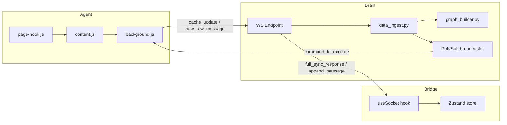
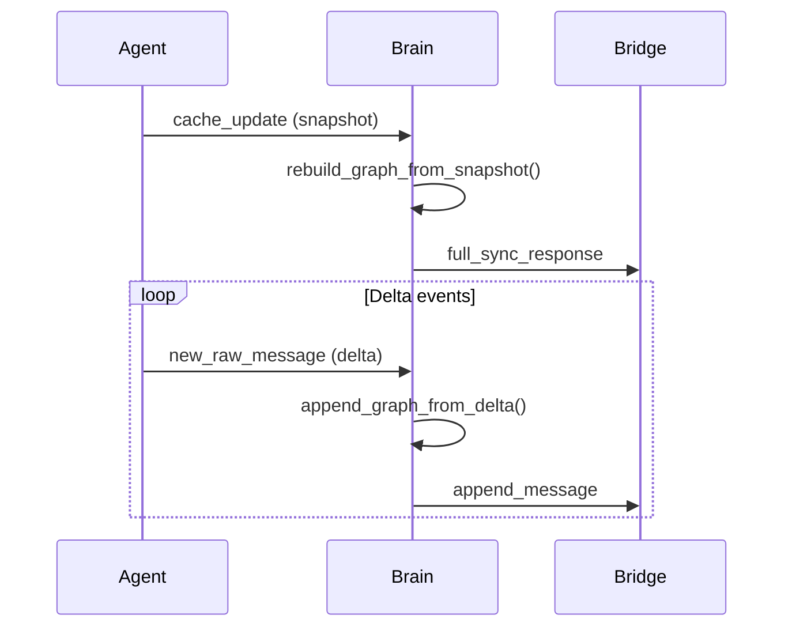

# Full-Stack Communication Specification  
**TO:** Project Team & AI Code Generators    
**FROM:** Principal Software Architect    
**DATE:** 2025-11-08    
**VERSION:** 1.1.0    
**SUBJECT:** Full-Stack Communication Specification for the OnlyFans Conversational Analytics Platform  
  
---  
## Introduction  
This document is the single source of truth for all data communication and API contracts between the "Brain," "Bridge," and "Agent" actors.    
It is designed to be 100% consistent with the `AI-instructions.md` project guide and serves as the final blueprint for system-wide communication.    
All new development or refactoring must adhere to this specification.  
  
**High-Level System Flow**  

  
## Part 1: The "Brain" (FastAPI Backend) Specification  
This section defines the architecture and API for the FastAPI server ("Brain"), which functions as the system's "mission control" for data ingestion, enrichment, and command generation.  
  
### 1.1 Core Communication Protocol: WSS Envelope  
A robust communication protocol is foundational to the system's stability.    
After analysis, a formal JSON‑RPC 2.0 protocol has been rejected — JSON‑RPC is oriented towards client‑initiated, action‑oriented remote procedure calls, which is antithetical to our event‑driven, server‑initiated push model.  
  
Instead, all WebSocket communication in both directions must utilize a standardized JSON envelope with a `type` and `payload` structure.    
This envelope must be enforced using **Pydantic Discriminated Unions** for both inbound and outbound messages (`IncomingWssMessage`, `OutgoingWssMessage`), with `Field(discriminator="type")` to ensure automatic validation and dispatch.  
  
The `OutgoingWssMessage` JSON schema must be exposed via a REST endpoint (`GET /api/v1/schemas/wss`) to allow 100% automated frontend type generation.  
  
### 1.2 WSS Ingestion Strategy: The Dual-Mode Protocol  
The existing “full‑sync‑on‑every‑message” anti‑pattern is replaced with a **snapshot‑then‑delta** pattern, a high‑performance standard for real‑time systems.    
Two distinct ingestion pipelines are required:  
  
**Snapshot vs Delta Flow**

#### 1.2.1 `cache_update` (Full-Sync / Snapshot)  
* **Flow:** Sent by the Agent once upon initial WebSocket connection.    
* **Payload:** Complete JSON array of all chats and messages from the Agent's local IndexedDB.    
* **Brain's Action:** Runs a full ingestion pipeline, rebuilding the conversation graph and analytics, then broadcasts `full_sync_response` to the Bridge.  
  
#### 1.2.2 `new_raw_message` (Event-Driven / Delta)  
* **Flow:** Sent by the Agent every time a single new message or event is captured.    
* **Payload:** A single JSON object representing only the new message.    
* **Brain's Action:** Routes to a lightweight ingestion path, appending to the graph and broadcasting `append_message`.  
  
**Ordering Guarantee:**    
All delta messages must be buffered in a per‑user `asyncio.Queue` until snapshot processing finishes, ensuring correct sequence and preventing race conditions.  
  
### 1.3 Command Generation Strategy: Decoupled Event Emitter  
The Brain's AI/enrichment services (e.g., `enrichment.py`) can generate commands that will be executed by the Agent.    
These services must not be directly coupled to the WebSocket network logic.  
  
To achieve this, the Brain implements a Redis‑backed Pub/Sub system (`encode/broadcaster`):  
* **Connection Management:** Stateless; no in‑memory `ConnectionManager`.    
* **Command Flow:**    
  1. AI service publishes a command to the appropriate channel (`agent_user_{id}`).    
  2. Any WS endpoint instance subscribed to that channel delivers the message to the connected Agent.  
  
### 1.4 MV3 Keepalive Handling  
The Brain must accept and ignore a `keepalive` message type from Agent, sent every 20 seconds, to maintain MV3 service worker persistence in the extension.

**MV3 Keepalive Flow**
```mermaid
sequenceDiagram  
    participant Agent  
    participant Brain  
  
    loop every 20s  
        Agent->>Brain: keepalive  
        Brain->>Brain: ignore and maintain WS connection  
    end  

    Note over Agent,Brain: Prevents idle termination  
  ```
  
### 1.5 API Contract 1: Brain-Bridge WSS Contract (Server ➔ Client)  
This table defines all messages sent from the Brain to the Bridge or Agent:  
  
| Message Type (`type`) | Payload Schema (Pydantic Model) | Direction | Description |  
| :--- | :--- | :--- | :--- |  
| `connection_ack` | `models.core.ConnectionInfo` | Brain ➔ Bridge | Sent immediately on successful WSS connection; confirms connection and provides system version. |  
| `system_status` | `models.core.SystemStatus` | Brain ➔ Bridge | Broadcasts the current status of the Brain (e.g., `PROCESSING_SNAPSHOT`, `REALTIME`). |  
| `system_error` | `models.core.WssError` | Brain ➔ Bridge | Reports a server‑side processing error to the frontend. |  
| `full_sync_response` | `models.insights.FullSyncResponse` | Brain ➔ Bridge | (Snapshot) Complete snapshot of all conversations, analytics, and graph data. Sent once after processing a `cache_update`. |  
| `append_message` | `models.graph.ConversationNode` | Brain ➔ Bridge | (Delta) Single new or updated conversation node. Sent after processing a `new_raw_message`. |  
| `analytics_update` | `models.insights.AnalyticsUpdate` | Brain ➔ Bridge | (Delta) Granular update to an analytics metric. |  
| `command_to_execute` | `models.commands.SendMessageCommand` | Brain ➔ Agent | AI‑generated command to be proxied to the Agent for execution. |  
  
### 1.6 API Contract 1b: Client-Brain WSS Contract (Client ➔ Server)  
| Message Type (`type`) | Payload Schema (Pydantic Model) | Direction | Description |  
| :--- | :--- | :--- | :--- |  
| `cache_update` | `models.ingest.CacheUpdatePayload` | Agent ➔ Brain | Full IndexedDB dataset; sent once on initial connection. |  
| `new_raw_message` | `models.ingest.NewRawMessagePayload` | Agent ➔ Brain | Single new message/event captured by the Agent. |  
| `keepalive` | `models.core.KeepalivePayload` | Agent ➔ Brain | Ping message with empty payload; sent every 20s to maintain MV3 service worker and WS connection. |  
  
---  
## Part 2: The "Bridge" (React Frontend) Specification  
The Bridge acts as the resilient translator, state manager, and user interface for the system.  
  
### 2.1 Type-Safety and Synchronization Strategy  
The Bridge must maintain 100% type‑safety with the Brain's API via:  
#### 2.1.1 REST API (OpenAPI)  
* **Tooling:** `@hey-api/openapi-ts` or equivalent.    
* **Workflow:** Generate REST types from backend OpenAPI JSON via `npm run sync:rest`.  
  
#### 2.1.2 WebSocket API (Automated)  
* **Specification:** WS types are auto‑generated from `/api/v1/schemas/wss` using `json-schema-to-typescript`.    
* **Mandate:** Generated files must never be edited manually.  
  
### 2.2 State Management Architecture: Zustand  
* **Store:** `frontend/src/store/useChatStore.ts` holds:  
  - Connection status (`readyState`)  
  - Conversations (`ConversationNode[]`)  
  - Analytics (`AnalyticsUpdate`)  
* **Logic:**    
  - Replace state on `full_sync_response`.    
  - Append/update node on `append_message`.    
  - Update status on `system_status`.    
  - Forward `command_to_execute` to Agent via ExtensionService.  
  
### 2.3 Resilient Communication Hooks  
#### 2.3.1 `useSocket` Hook  
* **Library:** `react-use-websocket`.    
* **Config:** Auto‑reconnect with exponential backoff.    
* **Role:** Manage WS lifecycle; route messages to store.  
  
#### 2.3.2 `ExtensionService` Module  
* **Role:** Sole interface for calling `chrome.runtime.sendMessage`.    
* **Error Handling:** Check `chrome.runtime.lastError` inside callback before resolving Promise.  
  
### 2.4 API Contract 2: Bridge-Agent Contract  
| Message Type (`type`) | Payload Schema (TypeScript) | Direction | Description |  
| :--- | :--- | :--- | :--- |  
| `get_all_chats_from_db` | `null` | Bridge ➔ Agent | Request initial data hydration; triggers Agent snapshot sync. |  
| `get_all_messages_from_db` | `{ chatId: string }` | Bridge ➔ Agent | Requests all messages for a specific chat. |  
| `execute_agent_command` | `SendMessageCommand` | Bridge ➔ Agent | Proxies command from Brain to Agent for execution. |  
  
---  
## Part 3: The "Agent" (Chrome Extension) Specification  
The Agent acts as the data source and command executor.  
  
### 3.1 Data Capture Architecture: Page-Hook Injection  
The `chrome.webRequest` API is insufficient; it cannot intercept WS message content or fetch response bodies.    
The extension must implement a 3‑file chain:  
* **`extension/page-hook.js`** — Injected into page world; monkey‑patches `fetch`, `WebSocket`, and `XMLHttpRequest` to capture traffic; forwards via `_OF_FORWARDER_`.  
* **`extension/content.js`** — Isolated world; listens for `_OF_FORWARDER_` and forwards to background.js.  
* **`extension/background.js`** — Service worker; stores events in IndexedDB and sends to Brain via WS.  
  
### 3.2 Data Forwarding & Sync Strategy  
#### Snapshot Flow  
1. Receive `get_all_chats_from_db` from Bridge.    
2. Query full IndexedDB dataset.    
3. Send as `cache_update` to Brain.  
  
#### Delta Flow  
1. Receive event from content.js.    
2. Save to IndexedDB.    
3. Send as `new_raw_message` to Brain.  
  
### 3.3 MV3 Persistence  
Background service worker sends `keepalive` WS messages every 20 seconds to maintain connection.  
  
### 3.4 Command Execution Architecture  
Reverse of capture:  
1. Brain sends `command_to_execute` to Agent via WS.    
2. Background.js forwards to content.js via `chrome.tabs.sendMessage`.    
3. Content.js posts `_OF_BACKEND_` to page-hook.js.    
4. Page-hook.js executes via original unpatched functions.  
  
### 3.5 API Contract 3: Page-Agent Contract (Internal)  
| Direction | Event Type (`data.type`) | Payload Schema (`data.payload`) | Purpose |  
| :--- | :--- | :--- | :--- |  
| Page ➔ Agent | `_OF_FORWARDER_` | `{ "event": "fetch" \| "websocket" \| "xhr", "data":... }` | Captured network event from page-hook.js. |  
| Agent ➔ Page | `_OF_BACKEND_` | `{ "command": "send_message", "payload":... }` | Command from Agent to execute in page context. |  
  
---  
## Changelog  
**v1.1.0** —    
- Pydantic Discriminated Union enforcement for WS messages.    
- `/api/v1/schemas/wss` endpoint for automated WS type generation.    
- Redis‑backed Pub/Sub architecture for horizontal scaling.    
- Asyncio.Queue per‑user to prevent snapshot/delta race conditions.    
- MV3 keepalive protocol handling.    
- Hardened Chrome extension messaging with `lastError` check.
- Embedded Mermaid diagrams for high‑level system flow, snapshot/delta sequence, and MV3 keepalive logic.
