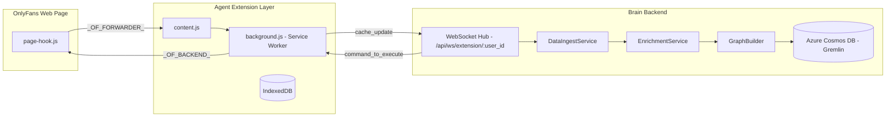

# Browser Extension — OnlyFans Conversational Analytics Agent

This MV3 Chrome extension ("Agent") captures chat and engagement events **directly in the browser**.

It stores the data locally in **IndexedDB** and streams it to the FastAPI backend ("Brain") for **real-time analytics**.

The Agent follows the **Full‑Stack Communication Spec v1.1.0** and adheres to **MV3 best practices** recommended in the Chrome Extension Policy Review.

## Architectural Overview

The Agent is the **data source** and **command executor** in a **3-actor system**:



**Flow Summary:**

1. `page-hook.js` intercepts chat events on the OnlyFans page.
2. `content.js` forwards events to `background.js`.
3. `background.js` caches events in IndexedDB and streams updates to the backend.
4. Backend may send commands back to `background.js`, which relays them to the page.

## Key Components

### `manifest.json` — Metadata & Permissions

| Field                    | Description                                     |
| ------------------------ | ----------------------------------------------- |
| Minimum Chrome           | `116` (required for MV3 keepalive)              |
| Permissions              | `"storage"`, `"tabs"`, `"scripting"`            |
| Host Permissions         | `https://onlyfans.com/*`                        |
| `externally_connectable` | Dev/Prod Bridge origins only                    |
| Security                 | No `page-hook.js` in `web_accessible_resources` |

### `background.js` — Orchestrator

* Maintains WebSocket connection; sends `{ type: "keepalive" }` every 20 s.
* IndexedDB: `OnlyFansAnalyticsDB` with stores `chats`, `messages`, `users`.
* Data flows:

  * Snapshot: `cache_update`
  * Delta: `new_raw_message`
  * Presence: `online_users_update`
* Forwards backend commands to the page via `_OF_BACKEND_`.


### `content.js` — Message Bridge

* **Page → Background:** `_OF_FORWARDER_` → `chrome.runtime.sendMessage`
* **Background → Page:** `_OF_BACKEND_` → `window.postMessage`


### `page-hook.js` — Event Interceptor

* Wraps WebSocket, fetch, XHR to capture events.
* Extracts creator `user_id` when available.
* Executes validated backend commands.
* Guards against double-injection.


## Security

> [!NOTE]  
> Passive capture only — **no DOM changes**.
- Strict origin checks and command allow-lists are enforced.
- Data remains local unless explicitly sent over WebSocket.  

## Development Notes

* Backend default: `http://localhost:8000` (update `WS_BASE` for production).
* `sendCacheUpdate()` can be triggered manually in the Service Worker console.
* Whitelist `http://localhost:8000/*` in `externally_connectable` for local Bridge development.
  

## QA Verification
> [!TIP]
> QA scripts under `qa/` are for local development only, **exclude** from production builds.  
  
* [`qa/qa-helper-sw.js`](qa/qa-helper-sw.js) — Run in SW console for injection, bridge, and keepalive tests.
* [`qa/qa-helper-page.js`](qa/qa-helper-page.js) — Run in main world console to simulate events.
> See [QA Usage Guide](qa/README.md) for complete helper scripts.  

## Appendix

### IndexedDB Schema

| Store Name | Key Field |
| ---------- | --------- |
| `messages` | `id`      |
| `chats`    | `id`      |
| `users`    | `id`      |
  

### WebSocket Payload Examples

**Snapshot:**

```jsonc
{
  "type": "cache_update",
  "payload": {
    "chats": [...],
    "messages": [...]
  }
}
```

**Delta:**

```jsonc
{
  "type": "new_raw_message",
  "payload": {
    "id": "m3",       // message ID
    "text": "Hello"   // message content
  }
}
```

**Presence Update:**

```jsonc
{
  "type": "online_users_update",
  "payload": {
    "user_ids": [123, 456],
    "timestamp": "2025-11-13T12:00:00Z"
  }
}
```

**Backend Command:**

```jsonc
{
  "type": "command_to_execute",
  "payload": {
    "action": "send_ws_message",
    "data": {...}
  }
}
```
