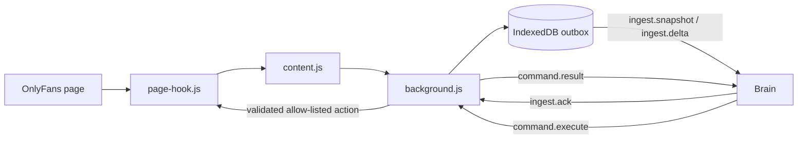

# Browser Extension Agent

The Agent is an MV3 browser extension for OnlyFans Conversational Analytics. It captures conversation data available to the logged-in creator, persists unacknowledged ingestion locally, and communicates with Brain through the role-specific protocol-v1 Agent channel.

This is an independent project and is not affiliated with or endorsed by OnlyFans or its operator.

## Responsibilities

- Capture creator-visible chats, messages, and presence observations from the OnlyFans page.
- Partition captured data by creator account.
- Persist snapshots and sequenced deltas in an IndexedDB outbox before network delivery.
- Resume or resynchronize ingestion after service-worker suspension or connection loss.
- Fetch, validate, and atomically apply Brain-owned capture and command configuration.
- Execute an explicitly allow-listed, operator-authorized set of actions delivered through the Brain command flow.
- Persist command results until Brain acknowledges them.

## Data flow


```mermaid
flowchart LR
  PAGE[OnlyFans page] --> HOOK[page-hook.js]
  HOOK --> CONTENT[content.js]
  CONTENT --> WORKER[background.js]
  WORKER --> OUTBOX[(IndexedDB outbox)]
  OUTBOX -->|ingest.snapshot / ingest.delta| BRAIN[Brain]
  BRAIN -->|ingest.ack| WORKER
  BRAIN -->|command.execute| WORKER
  WORKER -->|validated allow-listed action| HOOK
  WORKER -->|command.result| BRAIN
```

`page-hook.js` observes relevant page network activity and performs validated page-level actions. `content.js` provides the isolated-world message bridge. `background.js` composes the durable outbox, configuration client, WebSocket transport, and command service.

## Protocol behavior

Agent connects to `/ws/agent` and sends `agent.hello` before any domain message. Brain binds the socket to one authenticated `creator_account_id`, returns `agent.session`, and supplies the fencing token used by subsequent messages.

Raw ingestion uses:

- `ingest.snapshot` for an account-scoped view through a source sequence;
- `ingest.delta` for one durable sequenced change;
- `ingest.ack` and `ingest.rejected` for progress and failure handling; and
- `sync.required` when Brain requires a replacement snapshot.

Presence observations are ephemeral and use `presence.observed`. Configuration documents are fetched through the authenticated Agent configuration endpoint, while `config.available` and `config.applied` report revision state.

Commands use `command.execute`, `command.result`, and `command.result.ack`. Before execution, Agent validates the bound account, fencing token, deadline, command identifier, configured allow-list, and action schema. Duplicate command identifiers return the stored result instead of repeating the action.

## Local persistence

The ingestion outbox uses IndexedDB and survives MV3 worker suspension. Small bounded state, including Agent identity, applied configuration, and durable command results, uses extension local storage.

Capture is persisted before send. Brain becomes authoritative after acknowledging ingestion; the local outbox remains a retry source for unacknowledged data.

## Security boundary

- The extension accesses only data and actions available to the logged-in creator session.
- Command execution requires a valid Brain message and an action allowed by the active configuration.
- Page/content/worker messages use explicit markers and origin checks.
- Socket identity is account-bound and fenced.
- Configuration and command payloads are schema-validated.
- The extension does not grant Brain broader platform permissions than the creator session already has.

The development credential `bridge-clean-dev-ticket-v1` is an intentional non-secret fixture restricted to explicit local-development authentication mode.

## Verification

From this directory:

```powershell
npm test
```
