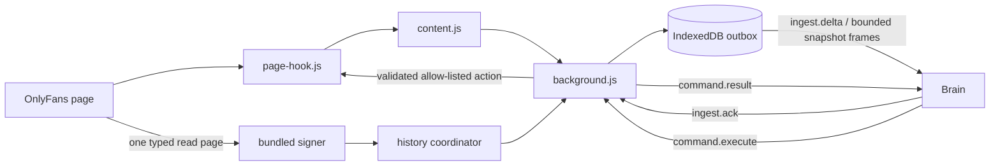

# Browser Extension Agent

The Agent is an MV3 browser extension for OnlyFans Conversational Analytics. It captures conversation data available to the logged-in creator, persists unacknowledged ingestion locally, and communicates with Brain through the role-specific protocol-v2 Agent channel.

This is an independent project and is not affiliated with or endorsed by OnlyFans or its operator.

## Responsibilities

- Capture creator-visible chats, messages, and presence observations from the OnlyFans page.
- Partition captured data by creator account.
- Schedule consented history reads across independently validated signer pages and advance an
  upstream cursor only with the atomic page commit.
- Persist sequenced deltas and bounded multi-frame repair snapshots in IndexedDB before delivery.
- Resume or resynchronize ingestion after service-worker suspension or connection loss.
- Fetch, validate, and atomically apply Brain-owned capture and command configuration.
- Execute an explicitly allow-listed, operator-authorized set of actions delivered through the Brain command flow.
- Persist command results until Brain acknowledges them.

## Data flow


```mermaid
flowchart LR
  PAGE[OnlyFans page] --> HOOK[page-hook.js]
  HOOK --> CONTENT[content.js]
  CONTENT --> WORKER[background.js]
  PAGE -->|one typed read page| SIGNER[bundled signer]
  SIGNER --> HISTORY[history coordinator]
  HISTORY --> WORKER
  WORKER --> OUTBOX[(IndexedDB outbox)]
  OUTBOX -->|ingest.delta / bounded snapshot frames| BRAIN[Brain]
  BRAIN -->|ingest.ack| WORKER
  BRAIN -->|command.execute| WORKER
  WORKER -->|validated allow-listed action| HOOK
  WORKER -->|command.result| BRAIN
```

`page-hook.js` observes relevant page network activity and performs validated page-level actions.
`content.js` provides the isolated-world message bridge. The locally bundled signer validates one
typed authenticated read page and returns canonical items plus opaque continuation or boundary
evidence. `background.js` composes Agent-owned cross-page scheduling, durable commits, retry state,
configuration, WebSocket transport, and command handling. Raw response bodies are discarded.

## Protocol behavior

Agent connects to `/ws/agent` and sends `agent.hello` before any domain message. Brain binds the socket to one authenticated `creator_account_id`, returns `agent.session`, and supplies the fencing token used by subsequent messages.

Raw ingestion uses:

- `ingest.snapshot` `begin`, bounded `chunk`, and `commit` frames for an account-scoped view
  through a source sequence;
- `ingest.delta` for one durable sequenced change;
- `ingest.ack` and `ingest.rejected` for progress and failure handling; and
- `sync.required` when Brain requires a replacement snapshot.

Presence observations are ephemeral and use `presence.observed`. Configuration documents are fetched through the authenticated Agent configuration endpoint, while `config.available` and `config.applied` report revision state.

Commands use `command.execute`, `command.result`, and `command.result.ack`. Before execution, Agent validates the bound account, fencing token, deadline, command identifier, configured allow-list, and action schema. Duplicate command identifiers return the stored result instead of repeating the action.

## Local persistence

Each Brain-authorized account has a stable hash-named IndexedDB database containing its outbox,
entities, checkpoints, configuration, jobs, commands, signer generations, snapshot state, and Brain
credentials. The exact account ID is validated inside that partition. `chrome.storage.local` stores
only `agent_installation_id`; `chrome.storage.session` stores only the opaque active partition name.

Capture is persisted before send. Brain becomes authoritative after acknowledging ingestion; the local outbox remains a retry source for unacknowledged data.

Snapshot construction is incremental and copy-on-write. Encoded frames are capped at 512 KiB,
the builder targets 448 KiB and 100 records, and one normalized entity above 384 KiB rejects
without truncation. Deltas above the snapshot boundary continue to be captured and wait until the
snapshot commit acknowledgement.

## MV3 lifecycle

`background.js` registers wake listeners synchronously, then initializes identity, IndexedDB, configuration, and transport through one idempotent runtime. Concurrent wakes share one initialization attempt. If initialization fails, the next startup, installation, runtime-message, or tab-update event retries it.

The socket and timers are disposable. A bound Agent session sends its protocol heartbeat at the Brain-provided interval; with the minimum supported Chromium version, that WebSocket activity also keeps only the live session active. The heartbeat stops when the socket closes. Suspension recovery depends on durable state and a fresh worker initialization, not on a permanent worker or timer.

## Security boundary

- The extension accesses only data and actions available to the logged-in creator session.
- Command execution requires a valid Brain message and an action allowed by the active configuration.
- Page/content/worker messages use explicit markers and origin checks.
- Socket identity is account-bound and fenced.
- Configuration and command payloads are schema-validated.
- `webRequest` is observation-only during signer renewal; `webRequestBlocking`, cookies, debugger,
  native messaging, remote executable code, and unexpected origins are prohibited by the build
  audit.
- The pinned signer tarball is compiled into a deterministic MV3 artifact; no runtime dependency
  or remote script is loaded.
- The extension does not grant Brain broader platform permissions than the creator session already has.

## Verification

From this directory:

```powershell
npm ci
npm test
npm run build
npm run audit
npm run qualify:snapshot:ci
npm run qualify:snapshot
```

`build` compiles twice and requires byte-identical outputs before writing `dist/`; `audit` verifies
the lockfile/tarball integrity, manifest permissions and CSP, bundled signer, output hashes, and
absence of remote-code constructs. The qualification commands exercise 10,000- and 100,000-message
bounded repair fixtures.
