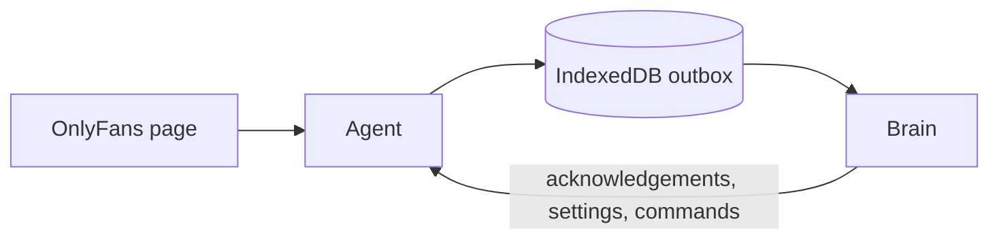

<!-- CODE-VERIFY: Verify capture behavior, persistence, signer behavior, permissions, and security boundaries against extension source, manifest, and build audit before editing. -->

# Agent browser extension

The Agent is the Chromium MV3 extension for OnlyFans Conversational Analytics. It captures conversation data available to the signed-in creator and sends it to Brain on the local machine.

## Responsibilities

- Capture creator-visible chats, messages, and presence observations.
- Keep captured data separated by creator account.
- Persist unacknowledged data locally before sending it to Brain.
- Resume or repair synchronization after connection loss or service-worker suspension.
- Apply Brain-owned capture settings and execute only allowed commands.

## Data flow

```mermaid
flowchart LR
    PAGE[OnlyFans page] --> AGENT[Agent]
    AGENT --> OUTBOX[(IndexedDB outbox)]
    OUTBOX --> BRAIN[Brain]
    BRAIN -->|acknowledgements, settings, commands| AGENT
```

The Agent keeps pending ingestion in IndexedDB. Brain becomes authoritative after it acknowledges the data.

Consented history reads use the bundled signer. The signer handles one validated page at a time; the Agent owns scheduling, durable progress, retries, and synchronization state.

## Security boundaries

- The Agent can access only data and actions available to the signed-in creator session.
- Brain binds each Agent connection to an authenticated creator account.
- Commands must pass account, session, configuration, and schema checks before execution.
- Raw platform responses, cookies, signing rules, and upstream cursors do not leave the Agent.
- The production extension does not use remote executable code, debugger access, native messaging, or cookie permissions.

## Related documentation

- [Communication overview](../communication-spec.md) — Agent/Brain protocol behavior.
- [Signer and bounded-state architecture](../docs/adr/0010-signer-history-acquisition-and-bounded-state.md) — history acquisition and synchronization decisions.
- [Testing](../docs/testing.md) — repository test and qualification entry points.
