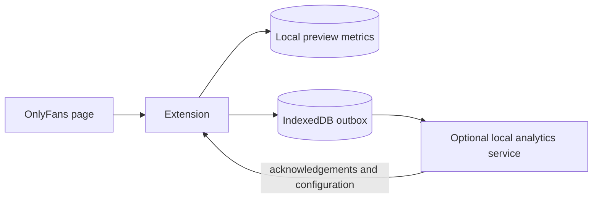

<!-- CODE-VERIFY: Verify capture behavior, persistence, signer behavior, permissions, and security boundaries against extension source, manifest, and build audit before editing. -->

# Browser extension

Conversation Analytics is a Chromium MV3 extension for creator-visible OnlyFans activity. It provides useful local metrics without requiring another application and can optionally connect to an analytics service running on the same computer.

## Standalone behavior

- Collection is off until the user enables it and grants access to OnlyFans.
- Preview mode records aggregate activity observations without storing message text or platform identifiers.
- The popup shows rolling seven-day metrics labelled “Observed in this browser.”
- Collection can be paused, and all extension data and optional permissions can be deleted from the popup.
- The preview remains functional when the optional local analytics service is not installed.

## Optional local integration

Full analytics mode requires a separate permission for the loopback analytics service. Captured records are kept in an IndexedDB outbox until that service acknowledges them. Account binding, configuration, schema, and command checks are enforced by the command-capable product runtime.

## Data flow

```mermaid
flowchart LR
    PAGE[OnlyFans page] --> EXTENSION[Extension]
    EXTENSION --> PREVIEW[(Local preview metrics)]
    EXTENSION --> OUTBOX[(IndexedDB outbox)]
    OUTBOX --> SERVICE[Optional local analytics service]
    SERVICE -->|acknowledgements and configuration| EXTENSION
```

Consented history reads use packaged signing logic for one validated platform revision. Requests are made to OnlyFans within the user’s existing authenticated browser session; the extension does not read or export raw passwords or authentication cookies. A revision mismatch fails closed and requires an extension update.

## Runtime variants

The source tree retains the command-capable runtime used by the complete local product. `background-read-only.js` is a separate entry point for a read-only distribution artifact. Its build graph advertises only capture and history capabilities and excludes command execution modules. `build.mjs` audits both the module graph and emitted archive before packaging.

## Security boundaries

- OnlyFans and loopback host access are optional permissions granted through user actions.
- The extension can access only data and actions available to the signed-in creator session.
- The local service binds each extension connection to an authenticated creator account.
- Commands must pass account, session, configuration, and schema checks before execution.
- Raw platform responses, authentication cookies, signing rules, and upstream cursors are not exported by the extension.
- Packaged artifacts do not use remote executable code, debugger access, native messaging, or cookie permissions.

## Related documentation

- [Communication overview](../communication-spec.md) — extension/local-service protocol behavior.
- [Signer and bounded-state architecture](../docs/adr/0010-signer-history-acquisition-and-bounded-state.md) — history acquisition and synchronization decisions.
- [Testing](../docs/testing.md) — repository test and qualification entry points.
