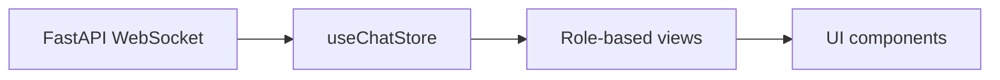

# Frontend — OnlyFans Conversational Analytics  
  
React + MUI dashboard built with Vite, served via FastAPI.    
  
Implements the finalized [`communication‑spec.md`](/communication-spec.md) following [`frontend-design-spec.md`](frontend-design-spec.md) with type‑safe WebSocket messaging, snapshot‑then‑delta ingestion, and role‑based views.  
  
---  
  
## 📖 Overview  
  
- **Framework**: React 18 + MUI 5 + Vite    
- **Served by**: FastAPI (Jinja template injects config into `index.html`)    
- **Data Sources**:  
  - **WebSocket** — Event‑driven updates from the Brain  
  - **REST** — `/api/v1/schemas/wss` (JSON schema for WS types), analytics endpoints    
- **State Management**: [Zustand](https://github.com/pmndrs/zustand) store with snapshot‑then‑delta logic    
- **Type Safety**:  
  - WS types auto‑generated from `/api/v1/schemas/wss`  
  - REST types generated from backend OpenAPI JSON  
  - Generated files are post‑processed to add named exports and the `OutgoingWssMessage` union — **never edit manually**  
- **Roles**:  
  - `"creator-ceo"` → CalmTriageView  
  - `"manager"` → PerformanceView  
  - `"operator"` → InboxView  
  
---  
  
## 📂 Structure  
  
### `index.html`    
Injects CSS/JS from Vite `manifest.json` and `FASTAPI_CONFIG` (extension ID, WS URL). Boots React app.  
  
### `package.json`    
Scripts for dev, build, and type sync (`sync:rest`, `sync:wss`, `sync:all`).  
  
### `vite.config.ts`    
React plugin, path aliases, output to FastAPI static dir, proxy `/api` and `/ws` in dev.  
  
### `main.tsx`    
Reads injected config and renders `<App>`.  
  
### `App.tsx`    
- Top AppBar: Search, Filters, WS connection status, debug toggle    
- Debug log: last 50 WS/system events shown in `<DebugPanel>`    
- Role‑based main views    
- Mobile Drawer for chat list    
- Global loading spinner and error snackbar  
  
---  
  
## 🧩 Components  
  
- **ChatList** — Conversation list    
- **MessageView** — Chat messages with metadata    
- **Fan360Sidebar** — Fan profile and enrichment info    
- **ConnectionStatusIndicator** — WS state display    
- **Placeholder** — Empty state    
- **DebugPanel** — Log viewer    
- **GlobalLoadingSpinner** — Processing overlay    
- **ErrorSnackbar** — Error toast  
  
---  
  
## 📄 Views  
  
- **CalmTriageView** — Priority inbox + KPIs    
- **PerformanceView** — Team metrics + drill‑down    
- **InboxView** — Operator console  
  
---  
  
## 🔌 Hooks  
  
- **useSocket** — Connects to WS, ignores keepalive, validates and dispatches messages to store    
- **usePermissions** — Role booleans based on `user.role`  
  
---  
  
## 🗄 Store  
  
**useChatStore** — Holds:  
- `user.role`, `readyState`, `chats`, `analytics`, `enrichment`, `lastMessage`    
- Reducers for WS events:  
  - `connection_ack`, `system_status`, `system_error`  
  - `full_sync_response`, `append_message`  
  - `analytics_update`, `enrichment_result`, `command_to_execute`  
  
---  
  
## 🔄 Data Flow  
  

  
---  
  
## 📐 Type Synchronization  
  
```bash  
npm run sync:wss   # WS types from /api/v1/schemas/wss  
npm run sync:rest  # REST types from OpenAPI spec  
npm run sync:all   # run both + postprocess types  
```  
  
---  
  
## 🧩 Bridge–Agent Contract  
  
Use **ExtensionService** (`sendMessageToAgent`) to send commands to the Chrome MV3 Agent:    
- Checks `chrome.runtime.lastError`    
- Rejects with descriptive error if messaging fails    
  
---  
  
## 🚀 Development  
  
```bash  
npm install  
npm run dev  
```  
Visit `http://localhost:5173` (dev) or served via FastAPI in production.  
  
---  
  
## 🏗 Build for FastAPI  
  
```bash  
npm run build  
# Outputs to ../app/static/dist with manifest.json  
```  
  
---  
  
## 🎨 Theme  
  
Primary blue `#2563EB`, success green `#16A34A`, warning amber `#FACC15`, error red `#DC2626`.    
Rounded corners, soft dividers, accessible focus outlines, `"Inter", "Roboto", sans-serif`.  
  
---  
  
## 📋 Dev Notes  
  
- Ignore `keepalive` WS messages in UI  
- Respect snapshot–delta ordering to prevent race conditions  
- Never edit generated type files manually  
- See [`communication-spec.md`](/communication-spec.md) for full system flow and WS protocol  
- See [`frontend-design-spec.md`](frontend-design-spec.md) for UX/UI guidelines  