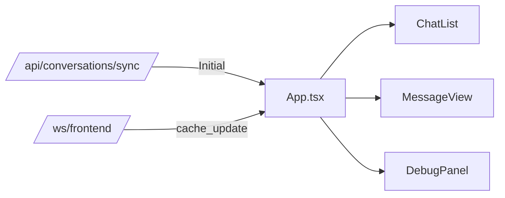

# Frontend — OnlyFans Conversational Analytics  
  
React + MUI dashboard built with Vite, served via FastAPI.  
  
---  
  
## Components  
  
### **index.html (Jinja template)**  
- Injects CSS files from Vite `manifest.json`.  
- Injects `FASTAPI_CONFIG` JSON with:  
  - `EXTENSION_ID`  
  - `FASTAPI_WS_URL`  
- Boots React app (`main.tsx`) in `#root`.  
  
---  
  
### **package.json**  
- Scripts:  
  - `dev`: Run Vite dev server (port 5173).  
  - `build`: Build to `../app/static/dist` for FastAPI serving.  
  - `generate-types`: Generate TypeScript types from backend OpenAPI.  
  
---  
  
### **vite.config.js**  
- Configures React plugin, path aliases (`@components`, `@types`).  
- Outputs build to FastAPI static directory with `manifest.json`.  
  
---  
  
### **main.tsx**  
- Reads injected config from `window.__FASTAPI_CONFIG__`.  
- Renders `<App config={config} />`.  
  
---  
  
### **App.tsx**  
Core layout:  
- **Chats Panel**: `<ChatList>` — lists all chats.  
- **Message Panel**: `<MessageView>` — messages for selected chat.  
- **Debug Panel**: `<DebugPanel>` — shows WS and sync logs.  
- Connects to `/api/conversations/sync` for initial data.  
- Connects to WS (`FASTAPI_WS_URL`) for real-time updates.  
  
---  
  
### **components/**  
- **ChatList.tsx** — Displays chat threads.  
- **MessageView.tsx** — Displays messages with bubbles, metadata, replies, flags.  
- **DebugPanel.tsx** — Displays logs, toggleable.  
  
---  
  
### **scripts/postprocess-types.js**  
- Post-processes `openapi-typescript` output.  
- Ensures named exports for `ChatThread` and `Message`.  
  
---  
  
## Data Flow  
  
